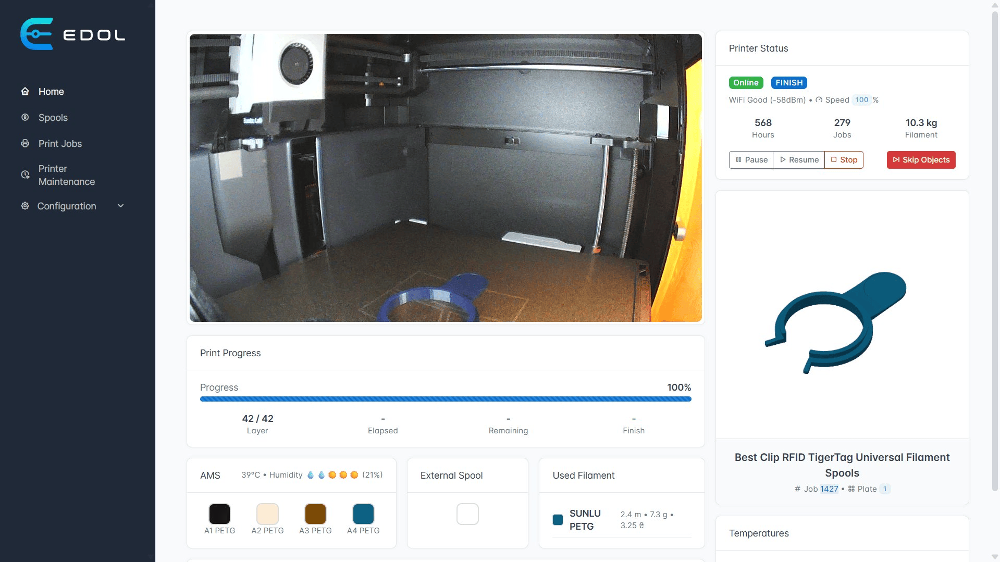

# Edol

Edol is a self-hosted automation, monitoring, and workflow ecosystem for 3D printing. Built around Bambu Lab printers and modern maker workflows, Edol combines real-time printer communication, filament inventory management, event-driven automation, notifications, and maintenance tracking into a single integrated platform.

The system connects directly to printers using MQTT, FTP, and camera streaming APIs to provide live printer state synchronization, automated event processing, spool tracking, print history management, and operational monitoring across one or multiple printers.

Edol is designed for makers, print farms, educational labs, and automation enthusiasts who want deeper control over their printing environment and a centralized platform for managing printers, filament, maintenance, and production workflows.



## Features

- Real-time printer monitoring via MQTT
- Live printer state synchronization
- Print event detection and automation workflows
- Telegram notifications and alerts
- Camera stream integration
- Filament and spool inventory management
- Remaining spool weight tracking
- Automatic filament consumption calculation
- Multi-spool support for complex prints
- Material, brand, and color organization
- Print history and spool usage linkage
- Printer maintenance tracking based on printing hours
- Maintenance scheduling and service history
- REST API for integrations and external tooling
- Event-driven architecture for extensibility
- Docker-based self-hosted deployment

## Supported Printers

Edol currently supports Bambu Lab printers with LAN mode enabled, including:

- Bambu Lab X1 Series
- Bambu Lab P1 Series
- Bambu Lab A1 Series

---

## Bambulab Firmware Versions

Throughout 2025, Bambulab released firmware updates that introduced a software mechanism called **“Authorization Control”**, which restricts certain MQTT communications while the printer is in **Cloud Connected** mode. These MQTT messages remain available in **LAN Only** mode when **Developer Mode** is enabled.

### To use the EDOL, you have two options

 1. Use an older firmware version released before the Authorization change.
This allows EDOL to work fully while keeping **Cloud Connected** mode enabled.

 2. Use a newer firmware version and switch the printer to LAN Only mode with Developer Mode enabled.
This allows to continue working on newer firmware versions.

### Compatible Firmware Versions

Below are the latest firmware versions for each Bambulab printer line that do **not** include the Authorization restrictions. Using versions up to (and including) these will allow you to fully enjoy all EDOL features and Cloud Connected mode without switching to LAN Only mode with Developer Mode enabled.

| Printer Line | Latest Compatible Firmware |
|---|---|
| A1 | `01.04.00.00` |
| P1 | `01.08.01.00` |
| X1 | `01.08.02.00` |
| H2 | All H2 printers include Authorization Control |
| P2 | All P2 printers include Authorization Control |

---


## Use Cases

- Home maker setups
- Multi-printer environments
- Print farms
- Educational laboratories
- Automated filament accounting systems
- Printer fleet monitoring
- Maintenance and service management
- Custom automation and notification workflows


# Build and Run

## Prerequisites

Before starting, make sure you have the following installed:

* Docker
* Docker Compose

You can verify the installation with:

```bash
docker --version
docker compose version
```

---

## Project Structure

The project consists of the following services:

* `edolcore-api` — library with common model entities
* `edolcore` — Bambu printer integration service
* `edoldashboard` — main backend service
* `edolnotify` — Notifying service (Telegram Bot)
* `edolams` — AMS controlling service for EDOL RFID Reader
* `mqtt` (`nanoMQ`) — MQTT broker used for communication

---

## Clone the Repository

Create a workspace directory for the project and persistent data:

```bash
mkdir -p ~/edol-project/{db-files,logs,models,camera_snapshots}
cd ~/edol-project
```

Clone the repository:

```bash
git clone https://github.com/serge-ponomarenko/edol.git
```

Navigate into the project code directory:

```bash
cd edol
```

---

## Environment Variables

For security and persistence reasons, keep the environment files outside of the Git repository.

Create (or copy) the following files in the project root directory:

```text
../.env_edol_core
../.env_edol_dashboard
../.env_edol_notify
../.env_edol_ams
```
These files are mounted into containers by Docker Compose and will remain safe during repository updates or re-cloning.

The resulting structure should look like this:

```text
edol-project/
│
├── .env_edol_core
├── .env_edol_dashboard
├── .env_edol_notify
├── .env_edol_ams
│
├── edol/
│   ├── docker/
│   │   ├── compose.yaml
│   │   └── *.Dockerfile
│   │   
│   ├── edol-core-api/
│   ├── edol-core/
│   ├── edol-dashboard/
│   ├── edol-notify/
│   └── edol-ams/
│
├── db-files/
├── logs/
├── models/
└── camera_snapshots/
```

---

## Project Configuration

### Edol Core Configuration

Edit `.env_edol_core` and configure:

* Bambu printer IP address
* Access token / printer credentials
* MQTT settings
* Camera or snapshot settings
* File storage paths if needed

For details see [section](#printer-connection-settings) below.

### Edol Dashboard Configuration

Edit `.env_edol_dashboard` and configure:

* The URL that be added to QR code on the spool label

### Edol Notify Configuration

Edit `.env_edol_notify` and configure:

* The Telegram tokens

---

## Build and Start

To build and start all services:

```bash
cd docker
docker compose up --build -d
```

This command will:

* Build the `edolcore`, `edoldashboard` and `edolnotify` images
* Start all containers in detached mode
* Automatically restart containers unless stopped manually

---

## Services and Ports

| Service       | Port Mapping | Description               |
|---------------|--------------|---------------------------|
| edolcore      | `8091:8080`  | Bambu integration service |
| edoldashboard | `8090:8090`  | Main backend API          |
| edolams       | `8099:8099`  | AMS Service               |
| edolnotify    | `-:-`        | Notify service            |
| mqtt/nanomq   | `-:1883`     | MQTT broker               |

---

## Viewing Logs

To view logs for all services:

```bash
docker compose logs -f
```

To view logs for a specific service:

```bash
docker compose logs -f edoldashboard
```

or

```bash
docker compose logs -f edolcore
```

---

## Stop the Project

To stop all running containers:

```bash
docker compose down
```

To stop and remove volumes:

```bash
docker compose down -v
```
---

## Update program

Navigate into the project docker directory:

```bash
cd ~/edol-project/edol/docker
```

Stop running containers:

```bash
docker compose down
```

Pull the latest changes:

```bash
cd ..
git pull
```

Build and start all services:

```bash
cd docker
docker compose up --build -d
```

---
## Printer Connection Settings

```.env_edol_core``` file

```env
# URL of your printer
BAMBU_CONNECT_URL=ssl://192.168.0.153:8883

# FTP address of the printer used for downloading models
BAMBU_FTP_URL=192.168.0.153

# Directory where printer stores model files.
# Depending on firmware and printer model it can be:
# - root directory (leave empty)
# - cache
# Connect to your printer over FTP (see in README) and check where the models are stored. 
BAMBU_MODEL_DIRECTORY=

# Printer camera stream address
CAMERA_URL=192.168.0.153

# Printer serial number
BAMBU_SERIAL=

# Printer LAN access code
# Can be found in printer network settings
BAMBU_ACCESS_CODE=

# Enable verbose MQTT logging.
# Useful for debugging printer communication.
# Recommended to disable in production.
BAMBU_SHOW_RAW_MQTT=true
```

---

# Bambu FTP connection

URL: `ftps://{DEVICE_IP}:990`

TLS: implicit

**Username:** `bblp`

**Password:** `dev_access_code` from a `Device` object (aka the LAN access code).

---

# Useful links
* https://github.com/Doridian/OpenBambuAPI
* https://synman.github.io/bambu-printer-manager/
* https://www.spoolease.io/index.html
* https://github.com/yanshay/spoolease

