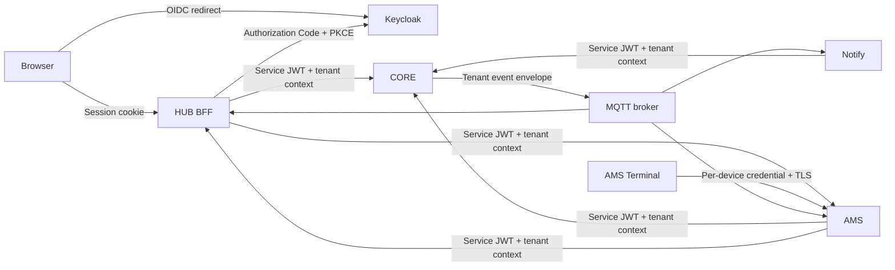
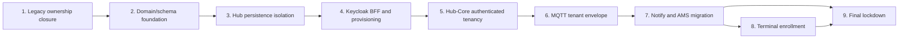

# Secure Multi-Tenant Migration Plan

- **Status:** Living plan
- **Architecture decision:** [ADR 0002](../adr/0002-secure-multi-tenant-architecture.md)
- **Ownership model:** [Tenant Ownership Matrix](tenant-ownership-matrix.md)
- **Initial audit date:** 2026-09-22

## Purpose

This plan moves EDOL from its current default-tenant bootstrap architecture to
authenticated, isolated multi-tenancy without locking out existing AMS and
Notify consumers. Each stage is independently reviewable and deployable. A
mandatory architecture audit follows every stage and may update the remaining
plan, but an architectural decision change must amend or supersede ADR 0002.

This document is a plan, not evidence that a stage has been implemented. The
factual current system remains described in `docs/architecture.md`.

## Audited Current State

### Stack and persistence

- The Maven reactor contains `edol-core-api`, Core, Hub, Notify, and AMS and
  uses Java 21 and Spring Boot 4.0.2.
- The resolved dependency set uses Hibernate ORM 7.2.1.Final, Spring Security
  7.0.2, and PostgreSQL JDBC 42.7.9. Deployment configuration uses PostgreSQL
  17.
- Hub Flyway is at V4 and Core Flyway is at V6 in the inspected databases.
- Hub owns `hub.tenants`, its printer projection, inventory, jobs, allocation,
  maintenance, and statistics. Core owns its printer catalog, connection
  configuration, and active print context.
- Hub currently stores `tenant_id` directly only on printers, filaments,
  vendors, and material types. Other ownership is derived or not yet enforced.
- There is no `User`, tenant membership, or tenant role table or entity.
- `TenantContext` resolves the database-marked default tenant. This is bootstrap
  behavior, not authorization.
- Repository/service code contains both tenant-scoped and ordinary unscoped
  access methods. `LegacyPrinterBackfillService` uses native `JdbcClient` SQL.
- `PrintJobService` persists fetched media from a raw
  `CompletableFuture.runAsync`, which does not carry a transaction or tenant
  context.

Repository evidence for these findings is:

| Area | Source of truth inspected |
| --- | --- |
| Versions and reactor | Root `pom.xml` and resolved Maven dependency versions |
| Hub schema | `edol-hub/src/main/resources/db/migration` V1 through V4 |
| Core schema | `edol-core/src/main/resources/db/migration` V1 through V6 |
| Ownership model | All Hub and Core `@Entity` types and repository interfaces |
| Default tenant | Hub `TenantContext`, tenant repository, and V3/V4 migrations |
| Native/background access | `LegacyPrinterBackfillService`, `PrintJobService`, startup recovery, and scheduled catalog/runtime services |
| HTTP security and clients | Module `SecurityConfig` types and every Core/Hub `RestClient` or `RestTemplate` caller |
| MQTT contracts | Core event listeners plus Hub, Notify, and AMS MQTT adapters |
| Deployment | `docker/compose.yaml` and module application configuration |

### Authentication and transport

- Hub and AMS disable CSRF and permit all requests.
- Core configures security components but permits its current application
  endpoints; service HTTP clients do not present OAuth identities.
- Core, Hub, Notify, and AMS do not yet have distinct machine identities.
- MQTT consumers subscribe to `edolcore/#`. Current event maps contain an
  `event` name and usually a `printerId`, but no trusted tenant ID, event ID,
  timestamp, or common versioned envelope.
- The audited tenant-owned Core topics are
  `edolcore/printer/online`, `edolcore/printer/offline`,
  `edolcore/print/started`, `running`, `paused`, `finished`, `failed`, `error`,
  `progress`, `ams`, `timelapse`, `metadata`, and `edolcore/ams`. Every one is
  in the additive-envelope migration; no current topic is silently exempted.
- The inspected broker configuration does not establish the target per-client
  authentication, TLS, publish/subscribe ACLs, or tenant-aware contract.
- Printer connection access codes are persisted and exposed through current
  management DTOs. Agent upload endpoints identify the caller with an
  `X-Agent-Id` value rather than a cryptographic machine identity; file-path
  containment also requires later hardening.

### Database findings

The configured PostgreSQL databases were inspected read-only. Both use
PostgreSQL 17 and contain the single legacy/default tenant expected by the
current architecture. The sampled ownership checks found no null required
printer mappings or cross-tenant inventory/allocation relationships. These are
point-in-time findings and do not replace deployment preflight checks.

| Inspected database | Tenants | Hub printers | Print jobs | Observed ownership anomalies |
| --- | ---: | ---: | ---: | --- |
| Local configured database | 1 | 2 | 463 | None in the audited checks |
| Second configured database | 1 | 1 | 581 | None in the audited checks |

Current application users own their tables and RLS is disabled. One configured
database user is a superuser with `BYPASSRLS`. RLS would be ineffective until
schema ownership, migrations, and application runtime identities are separated.
At least one inspected non-local connection also reported that SSL was not in
use, so database TLS is a required deployment hardening item rather than an
assumed property.

No DDL or DML was performed during the audit.

## Target State



Core remains passive and never calls Hub. Hub is the tenant, user, membership,
and business-authorization authority. Keycloak authenticates identities but
does not own the EDOL tenant model. Hibernate prevents accidental ordinary ORM
cross-tenant access, while forced PostgreSQL RLS protects the database access
path, including native SQL.

## Stage Dependencies



No runtime stage begins until ADR 0002, this plan, and the ownership matrix are
committed and reviewed together.

## Stage 1: Legacy Ownership Contract Closure

### Objective and prerequisites

Make every existing Hub/Core printer ownership path deterministic before adding
tenant enforcement. The current V4 projection and application-assisted
backfill must already report healthy.

### Scope and modules

- Hub and Core Flyway migrations, persistence models, backfill validation, and
  migration tests.
- No authentication, Keycloak, RLS, MQTT, Notify, or AMS behavior change.

### Schema and contract changes

- Verify that every legacy Hub print job, maintenance definition, and printer
  statistics row maps to exactly one Hub printer projection.
- Make the Hub UUID printer relationships mandatory only after verification.
- Contract the print-job legacy integer printer column and rename the UUID
  column to the stable printer column in a separate contract migration.
- Add the missing foreign key from Core active print context to Core printer.
- Preserve Core UUID as the cross-service printer identity.

There are no public HTTP or MQTT contract changes in this stage.

### Security invariants introduced

- No migration guesses or invents a printer identity.
- A persisted child cannot reference a nonexistent printer after contraction.
- Existing history remains attached to its validated printer.

### Compatibility and migration

Use expand, validate, and contract releases. Do not pair the final destructive
contraction with the initial validation release. Back up Hub and record Flyway
history before contraction. Ambiguous or orphaned mappings block deployment;
the migration must not guess, delete, or silently reassign data.

### Required tests

- Empty, current, and legacy schema Flyway chains in PostgreSQL Testcontainers.
- Null, orphan, duplicate, and ambiguous printer fixtures.
- Application-assisted backfill idempotency and Core-unavailable behavior.
- Existing multi-printer recovery and management tests.

### Rollback

Keep legacy-readable columns through the validation window. Before contraction,
rollback means deploying the prior application against the expanded schema.
After contraction, rollback requires the verified database backup and is not an
ordinary application rollback.

### Acceptance criteria

- No required Hub ownership relationship is null or ambiguous.
- Core active context cannot reference a nonexistent printer.
- The full reactor passes and migration evidence is attached to the stage
  audit.

### Explicitly out of scope

Tenant enforcement, user authentication, service authentication, and event
contract changes.

## Stage 2: Domain and Schema Foundation

### Objective and prerequisites

Represent users, memberships, tenant-safe cross-aggregate links, and Core
printer ownership without enabling enforcement. Stage 1 must be accepted.

### Scope and modules

Hub persistence and Flyway, Core printer persistence and Flyway, and schema
integration tests. Runtime request behavior remains compatible.

### Schema changes

- Add global Hub users with immutable unique OIDC `(issuer, subject)` identity
  and non-authoritative profile/audit fields.
- Add tenant memberships with tenant/user FKs, unique `(tenant_id, user_id)`,
  lifecycle fields, and the initial `OWNER` role.
- Add and backfill `tenant_id` on allocation groups, allocation items, and job
  spool usage.
- Add tenant-safe unique candidate keys and composite FKs for the cross-
  aggregate relationships where both tables persist tenant ownership.
- Add deferrable, initially immediate constraint triggers for cross-aggregate
  links to derived-owned previews, jobs, and spools. Trigger functions use
  invoker privileges, schema-qualified references, and no dynamic SQL.
- Add nullable `tenant_id` to Core printers without a cross-schema FK.
- Perform a guarded one-time Core backfill by joining the validated Hub printer
  projection. Fail if any Core printer is missing, duplicated, or disagrees
  with the projection. Validate, then make ownership mandatory in a later
  migration step.
- Add indexes for every direct and derived RLS ownership path.
- Classify the V3 seeded default tenant before authentication work. If it owns
  no printer, inventory, job, allocation, maintenance, statistics, or other
  tenant data, remove that empty seed so a clean installation is genuinely
  empty. If it owns any data, retain it unchanged for the controlled first-owner
  claim.

### API and event changes

None. New persistence fields are not yet accepted from untrusted requests and
MQTT remains unchanged.

### Security invariants introduced

- Every persisted entity has one approved direct or derived ownership source.
- Cross-aggregate links cannot join different tenants after constraint
  validation.
- Core tenant ownership has no runtime dependency on Hub and no foreign key to
  the Hub schema.

### Compatibility and migration

Use nullable/additive columns and not-yet-validated constraints first. Backfill
in bounded batches where production data size requires it. The Core backfill is
the only migration-time cross-schema operation; no runtime component receives
Hub schema access.

### Required tests

- Empty/current/legacy Flyway paths and rollback-compatible application startup.
- Idempotent backfill and constraint validation.
- Fixtures where an allocation or usage row connects different tenants.
- Membership uniqueness and invalid role values.
- Core printers with missing, duplicate, or conflicting Hub projections.

### Rollback

The expanded schema remains readable by the prior application. Do not drop old
constraints or make new fields mandatory until validation succeeds. Data added
by the new release is retained on rollback.

### Acceptance criteria

- Every persisted entity has the approved direct or derived ownership path.
- Every Core printer has exactly one opaque tenant UUID originating from the
  migration backfill.
- No Core runtime code queries Hub to establish tenant ownership.

### Explicitly out of scope

RLS, `@TenantId`, login, tenant selection, and secure service transport.

## Stage 3: Hub Persistence Isolation with an Explicit Legacy Bridge

### Objective and prerequisites

Make Hub persistence fail closed under Hibernate and PostgreSQL RLS before
introducing Keycloak, while temporarily keeping the single-tenant deployment
operational through a visible migration boundary. Stage 2 must be accepted.

### Scope and modules

Hub persistence configuration, transaction boundaries, scheduled/asynchronous
work, database identities, RLS migrations, and isolation tests.

### Persistence and schema changes

- Apply `@TenantId` to approved direct Hub tenant entities.
- Implement a fail-closed `CurrentTenantIdentifierResolver` with no default
  tenant lookup or hardcoded UUID.
- Disable Open EntityManager in View and define explicit service transaction
  boundaries.
- At transaction start, execute parameterized
  `set_config('edol.tenant_id', tenant, true)` on the same connection.
- Create `USING` and `WITH CHECK` policies for direct and derived ownership,
  enable and force RLS, and verify supporting indexes.
- Separate schema owner, Flyway executor, and Hub runtime roles. The Hub runtime
  is neither owner, superuser, nor `BYPASSRLS`.
- Replace raw asynchronous persistence with tenant-aware managed executors or
  explicit tenant-scoped work units and new transactions.

### Explicit migration compatibility mechanism

Implement `LegacyDefaultTenantCompatibilityScope` only at enumerated pre-auth
Hub HTTP and background entry points. It reads a configured legacy tenant UUID,
verifies that the tenant exists and is marked as the migration tenant, opens an
explicit trusted scope, and records a structured log and metric.

This component is not called by the tenant resolver. Ordinary application code
with no context fails immediately. The compatibility configuration has an
explicit migration name and cannot be interpreted as a permanent default.

### API, event, and data migration impact

Public HTTP and MQTT payloads do not change. RLS is enabled only after the
Stage 2 ownership backfills and constraints have been revalidated in the target
environment. No new ownership data is inferred in this stage; database-role
and policy deployment is the migration boundary.

### Security invariants introduced

- Missing tenant context denies ordinary ORM and SQL access.
- Runtime database roles cannot disable or bypass forced RLS.
- Transaction-local tenant state cannot survive commit, rollback, or pooled
  connection reuse.
- Async and scheduled persistence starts a fresh trusted tenant transaction.

### Required tests

- ORM identifier loads, repositories, associations, inserts, updates, and
  deletes across two tenants.
- Native SQL attempts through `JdbcClient` under both tenants.
- Missing, malformed, and changed tenant context.
- Connection reuse proves transaction-local state does not leak through the
  pool, including rollback and exception paths.
- Scheduled and async work proves context establishment and cleanup.
- Direct runtime role tests prove cross-tenant reads/writes are denied.
- Compatibility entry points are enumerated and every use is observable.

### Rollback

Rollback deploys the Stage 2 application and its compatible runtime grants.
Never repair a rollout by adding a fallback to the resolver or granting the Hub
runtime RLS bypass.

### Acceptance criteria

- Normal Hub persistence cannot read or mutate tenant data without a trusted
  context.
- The only pre-auth default-tenant behavior is the named, measured compatibility
  scope.
- Native SQL is contained by RLS and connection-pool leakage tests pass.

### Explicitly out of scope

Keycloak, Core RLS, and Core service authentication.

## Stage 4: Keycloak BFF and JIT Provisioning

### Objective and prerequisites

Replace the pre-auth compatibility boundary with authenticated users,
memberships, and server-side active tenant selection. Stage 3 must be accepted,
and Keycloak production hostname, TLS, mail delivery, backup, and secret
management must be ready.

### Scope and modules

Hub security, Keycloak client/realm deployment configuration, user and
membership services, browser templates, session handling, and audit events.

### Authentication and provisioning changes

- Configure confidential `edol-hub-web` Authorization Code + PKCE integration,
  five-minute access tokens, a 30-minute idle/eight-hour maximum Hub session,
  and no offline tokens.
- Store OAuth tokens server-side and use secure, `HttpOnly`, `SameSite=Lax`
  cookies. Enable CSRF for browser state changes.
- Map identities by issuer and subject; treat email and display data as profile
  attributes, not stable keys.
- Propagate the validated issuer and subject for pre-tenant user and membership
  discovery through transaction-local `edol.oidc_issuer` and
  `edol.oidc_subject`; do not establish tenant context until membership or JIT
  provisioning authorizes it.
- Provision User, Tenant when required, and `OWNER` membership in one idempotent
  Hub transaction.
- For an existing database, allow the first authenticated user to claim the one
  unclaimed legacy tenant only with zero users, zero memberships, and an
  explicitly opened bootstrap window. Serialize concurrent claims and close
  the window atomically.
- On a clean system, and for later independent self-registration while that
  product mode remains enabled, create a new tenant and `OWNER` membership.
  Future invitations attach users to existing tenants without changing the
  identity model.
- Auto-select one membership. A tenant-selection endpoint accepts a tenant ID
  only as a candidate, revalidates membership, and stores the result in the
  server-side session.

### Schema, API, event, and migration impact

- Reuse the Stage 2 user and membership schema; no tenant ownership column or
  persistent session table is added. The current single-instance deployment
  uses an in-memory servlet session and authorized-client store, so a restart
  logs users out rather than persisting refresh tokens in the EDOL database.
- Add the OIDC login/callback/logout routes and an authenticated active-tenant
  selection endpoint. MQTT contracts do not change.
- Existing data migration is the atomic first-owner claim of the already
  backfilled legacy tenant. Clean databases create a tenant during JIT; there
  is no bulk data backfill.
- After a non-empty legacy tenant has been claimed, remove `tenants.is_default`
  and its single-default index in the Stage 4 cleanup migration. Stage 4 is not
  accepted while default-marker schema or normal user-runtime default semantics
  remain. The separately named AMS compatibility adapter is tracked until
  Stage 7 and is never consulted by `TenantContext`.

### Mandatory compatibility removal

Delete `LegacyDefaultTenantCompatibilityScope`, its configuration keys, its
entry-point wiring, and its tests in this stage. Do not merely disable it. The
normal resolver remains fail-closed throughout.

The existing AMS backend still needs Hub access until Stage 7. Replace broad
anonymous Hub access with an internal-ingress, measured compatibility allowlist
containing only:

```text
GET  /api/spools/find-by-id
GET  /api/spools/find
POST /s/{printerId}/{spoolId}/{slot}
```

The adapter resolves only resources in the existing legacy tenant, cannot
accept a browser-supplied tenant header, and is not reachable through the
normal public browser ingress. It is separate from the deleted default-tenant
request scope and remains explicit technical debt until AMS migration. Its
internal ingress maps only the allowlisted legacy AMS caller to an explicitly
configured tenant; the application never looks up a default tenant. If the
deployment cannot make that internal ingress trustworthy and unreachable from
the browser network, Stage 4 is blocked until AMS receives its service
credential.

### Security invariants introduced

- A browser session cannot establish a tenant without a current membership.
- OIDC issuer/subject, not email or username, identifies the EDOL user.
- OAuth tokens remain server-side and state-changing browser requests require
  CSRF validation.
- The first-user bootstrap is single-use, serialized, and observable.

### Required tests

- Login, callback, logout, CSRF, session fixation, secure cookie, token expiry,
  and disabled IdP user behavior.
- JIT retry after Hub transaction failure without deleting the IdP identity.
- Concurrent first-user claim and unexpected preexisting users/memberships.
- Single and multiple membership selection, revoked membership, stale session,
  and forged browser tenant header.
- Repository-wide check that default fallback code and configuration no longer
  exist in runtime paths.

### Rollback

Rollback uses the complete Stage 3 artifact, including its explicit bridge. A
Stage 4 artifact must never silently recreate default fallback behavior.

### Acceptance criteria

- Every normal Hub request has an authenticated user and validated active
  membership before tenant-owned persistence access.
- No browser token is available to JavaScript.
- No default-tenant compatibility component remains in Stage 4 code or
  configuration.

### Explicitly out of scope

Additional tenant roles, invitations, delegated Core user tokens, and Core
global lockdown.

## Stage 5: Authenticated Hub-to-Core Tenancy and Core Isolation

### Objective and prerequisites

Secure Hub-to-Core traffic, persist trusted Core ownership on provisioning, and
isolate Core data while preserving bounded compatibility for Notify and AMS.
Stage 4 must be accepted.

### Scope and modules

Hub Core client, Core resource server, Core persistence/RLS, printer management
contract, database roles, deployment networking, and contract tests.

### API and authorization changes

- Create `edol-hub-service` with five-minute client-credentials tokens for
  audience `edol-core-api` and the ADR-defined `tenant.context`,
  `core.printer.read`, `core.printer.manage`, `core.state.read`,
  `core.command.execute`, and `core.media.read` scopes.
- Hub sets `X-EDOL-Tenant-Id` from its trusted active context and replaces any
  inbound value. Core accepts it only from the authorized Hub client with the
  tenant-context authority.
- Core persists the context tenant when Hub provisions a printer. Tenant is not
  accepted as a freely writable request-body field.
- Existing resource operations resolve stored ownership and return not found
  when it differs. Ordinary updates cannot transfer a printer.
- Core validates issuer, signature, expiry, not-before, audience, client, and
  scopes on every secured endpoint.

### Core RLS and background runtime

- Apply Core `@TenantId`, transaction-local tenant state, RLS, forced policies,
  and separate migration/runtime roles according to ADR 0002.
- Add `edol_core_catalog_runtime` as a non-owner, non-superuser,
  `NOBYPASSRLS` read-only identity.
- Grant it only the columns required to enumerate enabled printers and establish
  connections, with role-specific `FOR SELECT` policies on those catalog
  tables. Grant no DML or Hub schema access.
- Expose that datasource only through `CoreRuntimeCatalogEnumerator`. An
  architecture test prevents controllers and general services from depending
  on it.
- After enumeration, each printer's operational work runs under the normal
  datasource in an explicit tenant-scoped transaction.

### Schema and migration impact

Stage 2 already added and backfilled Core printer ownership. This stage
revalidates it, makes it mandatory if that contraction was intentionally
deferred, and adds Core RLS policies, forced enforcement, and role grants. No
runtime cross-schema backfill or tenant lookup is introduced.

### Compatibility strategy

Do not globally require the new authentication contract from Notify and AMS in
this stage. Keep a source-network-restricted, measured allowlist containing
only their exact existing Core endpoints:

```text
GET  /api/printers
GET  /api/printers/state
GET  /api/printers/{printerId}/state
GET  /api/printers/{printerId}/camera/status-image
POST /api/printers/{printerId}/commands/stop
POST /api/printers/{printerId}/commands/resume
POST /api/printers/{printerId}/commands/pause
POST /api/printers/{printerId}/commands/fetchmetadata
POST /api/printers/{printerId}/commands/pushall
```

A legacy request may address only an already known printer in the single
legacy tenant; catalog/state-list responses contain only that tenant. It cannot
provision, reassign, read connection secrets, or reach a new tenant. Tenant
resolution for printer-specific endpoints comes from persisted printer
ownership. The two list endpoints are bound at the compatibility adapter to an
explicitly configured legacy tenant. Neither path invokes normal resolver
fallback, and every invocation is logged and metered.

### Security invariants introduced

- A service token without the correct audience, client, scope, and trusted
  tenant context cannot access Core tenant resources.
- Core resource ownership is persisted at provisioning and cannot be changed by
  ordinary update.
- The read-only catalog identity cannot be reached from HTTP and cannot perform
  DML or access non-catalog data.
- Legacy consumers cannot provision or reach a non-legacy tenant.

### Required tests

- Invalid issuer, signature, audience, scope, client, expiry, and not-before.
- Missing/spoofed tenant header, browser-direct Core request, and valid foreign
  printer UUID.
- Concurrent Hub provisioning and body/header tenant mismatch.
- Hibernate and native SQL Core isolation, RLS pooled-connection cleanup, and
  Core background recovery.
- Database tests prove catalog role DML, non-catalog table, and Hub schema
  access are denied.
- Architecture test proves HTTP/controller code cannot inject the catalog
  enumerator or datasource.
- Legacy allowlist accepts only documented existing consumer paths and emits
  usage metrics.

### Rollback

Keep additive ownership and authenticated endpoint behavior compatible with the
prior Core release. Roll back Hub and Core together where their secure contract
changes. Do not broaden the legacy allowlist as a rollback shortcut.

### Acceptance criteria

- All Hub-to-Core requests use the authenticated tenant-aware contract.
- Core creates ownership only from the trusted Hub context and never calls Hub.
- The catalog identity cannot write, access Hub, or become a general RLS bypass.
- Notify and AMS continue operating only through the documented temporary
  compatibility boundary.

### Explicitly out of scope

Notify/AMS client migration, terminal pairing, and legacy allowlist removal.

## Stage 6: MQTT Tenant Envelope

### Objective and prerequisites

Give consumers authenticated, unambiguous tenant context without breaking
older Notify and AMS versions. Stage 5 must be accepted and every Core printer
must have persisted tenant ownership.

### Scope and modules

Core event publishing, `edol-core-api` event contracts where appropriate, Hub
consumption, broker publisher policy, compatibility metrics, and contract
tests. Notify and AMS retain legacy field support in this stage.

### Event changes

- Add `schemaVersion`, UUID `eventId`, stable `eventType`, `tenantId`,
  `printerId`, RFC 3339 `timestamp`, and nested `payload` to every tenant-owned
  Core event.
- Retain the existing `event` and top-level payload fields in the same message
  for compatibility. Do not dual-publish duplicate logical events.
- Derive tenant only from the persisted Core printer, never from device
  telemetry or an incoming MQTT payload.
- Hub validates tenant/printer consistency before applying an event and uses
  `eventId` for idempotency where a duplicate could mutate persistence.

### Schema and data migration impact

No domain schema or backfill is required. Consumer-side idempotency storage may
be added only where an existing persisted mutation cannot be made naturally
idempotent; its retention and cleanup are part of that consumer's stage diff.

### Security invariants introduced

- An event tenant is derived from persisted Core ownership, never from printer
  telemetry or a consumer guess.
- Consumers reject missing, malformed, unknown, or locally mismatched tenant
  context before mutation.
- Only the Core broker identity may publish Core integration events.

### Compatibility and broker rollout

Introduce a Core-only publisher identity and publish ACL as soon as it can
coexist with legacy anonymous or shared subscriber access. Measure which
consumers still read legacy fields. Subscriber identities, TLS, and restrictive
subscribe ACLs become mandatory when Notify and AMS migrate.

### Required tests

- Contract fixtures for every currently published topic and event type.
- Old and new consumers reading one additive message.
- Duplicate and reordered QoS 1 delivery.
- Unknown printer, missing ownership, and mismatched tenant handling.
- Broker ACL prevents non-Core publishing without preventing the compatibility
  subscriber rollout.

### Rollback

Keep consumers capable of reading legacy fields throughout the stage. Rollback
removes envelope production only before any consumer declares it mandatory.

### Acceptance criteria

- Every tenant-owned event contains trusted tenant and printer identities,
  version, timestamp, and event ID.
- Existing Notify and AMS continue to operate during the compatibility window.

### Explicitly out of scope

Removal of legacy fields and final subscriber lockdown.

## Stage 7: Notify and AMS Service Migration

### Objective and prerequisites

Give Notify and AMS independent machine identities and tenant-aware event/API
processing. Stage 6 must be accepted.

### Scope and modules

Notify, AMS, their Core/Hub HTTP clients, MQTT connections, service-specific
configuration, and end-to-end contract tests.

### Changes

- Create `edol-notify-service` with five-minute tokens and
  `tenant.context`, `core.printer.read`, `core.state.read`,
  `core.command.execute`, and `core.media.read` scopes.
- Create `edol-ams-service` with five-minute tokens and `tenant.context`,
  `core.state.read`, `hub.spool.read`, and `hub.spool.change` scopes for the
  applicable resource-server audiences.
- Validate MQTT envelope version, tenant, printer, event ID, and timestamp.
- Give each service a separate TLS MQTT subscriber identity and topic ACL.
- Replace Notify's global Telegram administrator assumption with tenant-to-
  recipient configuration before processing multiple tenants.
- Derive AMS tenant from authenticated terminal, event, or persisted
  configuration context. Authenticate AMS-to-Core and AMS-to-Hub separately.
- Propagate a tenant header only after establishing it from trusted local state.

### Schema, API, event, and migration impact

- Do not introduce a Notify database solely for this stage. Replace the single
  administrator value with deployment-managed tenant-to-recipient mappings.
- Until Stage 8 supplies a terminal registry, AMS uses an explicit deployment
  mapping of existing printer UUIDs to tenants and fails closed for an unmapped
  printer; do not learn that mapping from an untrusted terminal request.
- Existing HTTP request shapes remain stable while OAuth headers and trusted
  tenant propagation are added. Consumers switch to the v2 MQTT envelope but
  tolerate its additive legacy fields.
- There is no historical data backfill beyond validating configured mappings
  against the existing printer catalog.

### Security invariants introduced

- Notify and AMS have different credentials and cannot use one another's
  scopes.
- Recipient selection and AMS processing are tenant-bound.
- A terminal request cannot make AMS trust an arbitrary tenant or printer.

### Compatibility

Migrate and verify each service independently. Keep the Core legacy HTTP
allowlist, the AMS-only Hub allowlist, and MQTT legacy fields until both
services have zero observed legacy usage. Do not remove compatibility in the
same deployment that introduces the new clients.

### Required tests

- Wrong/revoked/rotated service secret, audience, scope, and tenant.
- One compromised service credential cannot use another service's scopes.
- Two tenants and two printers across HTTP, MQTT, Notify recipients, and AMS
  spool state.
- Mixed-version rollout and rollback for each consumer.
- TLS and MQTT publish/subscribe ACL enforcement.

### Rollback

Roll back Notify and AMS independently while their exact legacy compatibility
paths remain available. Do not reintroduce a shared global credential.

### Acceptance criteria

- Notify and AMS no longer use unauthenticated Core or Hub calls.
- Their event processing cannot guess tenant from a printer ID supplied by an
  untrusted source.
- Legacy usage metrics remain zero for the agreed observation window.

### Explicitly out of scope

AMS Terminal pairing and removal of compatibility contracts.

## Stage 8: AMS Terminal Enrollment

### Objective and prerequisites

Introduce revocable per-device identity without using human credentials on an
ESP32. Stage 7 authentication must be accepted and AMS must have durable
persistence and tenant isolation.

### Scope and modules

AMS persistence and device authentication, Hub-to-AMS management API, Hub
owner-facing UX, ESP32 protocol documentation, and security tests.

### Schema and API changes

- AMS owns tenant-scoped terminal and terminal-pairing records.
- Hub exposes owner-authorized create, revoke, rotate, and re-pair actions and
  calls AMS with its service identity and trusted tenant context.
- Pairing creation returns a 10-character Crockford Base32 code with roughly 50
  bits of entropy, five-minute lifetime, maximum five failed attempts, and
  rate-limited verification. Store only a keyed digest.
- `POST /enroll` consumes the pairing credential atomically over TLS and returns
  `terminalId.secret` once, where the secret contains 32 random bytes.
- Store only a keyed credential digest and version in AMS. Compare in constant
  time. Store the credential in encrypted NVS/flash on the terminal.
- Restrict the credential to the terminal, tenant, allowed printer, and narrow
  AMS API. Support revocation, versioned rotation, and re-pairing.
- Factory reset or replacement requires revoking the old terminal and issuing a
  new pairing credential.

### Compatibility

Existing AMS backend service authentication remains unchanged. No pairing code
or user/service credential becomes a permanent device credential.

### Migration and backfill

Create terminal tables additively. Existing physical terminals remain outside
the authenticated device model until explicitly paired; do not synthesize
credentials or silently enroll them. Deployment may keep their old UI disabled
or network-restricted during enrollment, but it may not translate an old
pairing code into a permanent credential.

### Security invariants introduced

- Pairing credentials are short-lived, single-use, tenant-bound, and stored
  only as digests.
- Persistent credentials are unique per terminal, stored only as keyed digests
  by AMS, and never returned again after enrollment.
- Revoked, replaced, or factory-reset devices cannot recover their old access.

### Required tests

- Guessing/rate limit, expiry, attempt exhaustion, replay, and concurrent
  consume.
- Wrong tenant/printer/API, revoked credential, rotation, and re-pair.
- Credential disclosure response occurs only once.
- TLS validation failure and terminal storage/recovery behavior.

### Rollback

Disable new enrollment while retaining revocation and existing terminal
records. Never fall back to accepting pairing codes as operational credentials.

### Acceptance criteria

- Every terminal has an independent, revocable credential.
- Pairing is tenant-bound, single-use, short-lived, and brute-force resistant.
- Human login and backend service credentials are absent from the terminal.

### Explicitly out of scope

OAuth Device Authorization Grant, direct terminal-to-Core access, and
user-delegated OAuth on the ESP32.

## Stage 9: Final Lockdown and Hardening

### Objective and prerequisites

Remove all migration compatibility after every HTTP and MQTT consumer has used
the secure contracts with zero legacy traffic for an agreed observation
window. Stages 7 and 8 must be accepted.

### Scope and modules

All service security configurations, broker and database deployment, Core agent
and media ingress, secret handling, deprecated HTTP/event adapters, and
end-to-end operational tests.

### Changes

- Remove the Core unauthenticated allowlist and obsolete HTTP Basic or shared
  credential paths.
- Remove legacy MQTT top-level fields and reject unsupported envelope versions
  according to an announced contract schedule.
- Require per-client MQTT TLS identities and least-privilege ACLs.
- Move high-value service clients to `private_key_jwt`, with documented key
  overlap and rotation procedures.
- Require TLS for database connections and remove unnecessary public service
  port exposure.
- Replace `X-Agent-Id` trust with a distinct agent machine identity and narrow
  upload scopes.
- Stop returning printer access codes from broad management DTOs, protect stored
  values according to the selected secret-storage facility, and define
  rotation.
- Enforce upload path containment, file type/size limits, and audit logging.

### Schema, API, event, and migration impact

- Remove legacy HTTP routes/authorization branches and legacy MQTT fields as
  versioned contract changes. Announce the supported event version before
  rollout.
- Add only the credential/key metadata needed for agent identity and secret
  rotation; no tenant ownership model changes are expected.
- No business-data backfill is required. Credential and key rollout uses an
  overlap window, then revokes the old material.

### Compatibility and security invariants

Compatibility removal happens only after usage metrics remain at zero for the
deployment change's observation window. After removal, every HTTP/MQTT/device
operation requires its dedicated identity, tenant isolation is always active,
and no runtime database identity can bypass forced RLS.

### Required tests

- Full cross-tenant and service-compromise negative suite.
- No unauthenticated HTTP or anonymous MQTT success path.
- Client-secret and asymmetric-key rotation drills.
- Database TLS, grants, RLS, and backup/restore verification.
- Upload traversal, oversized payload, and wrong agent identity tests.
- Operational rollback and recovery drill.

### Rollback

Compatibility removal occurs only after verified zero use and a deployment
backup. A rollback restores the immediately preceding authenticated consumers;
it does not reopen public unauthenticated access without a separately approved
incident change.

### Acceptance criteria

- Every HTTP and MQTT caller has an independent authenticated identity.
- No legacy default tenant, unauthenticated service path, shared broker identity,
  or legacy event contract remains.
- Application database identities cannot bypass forced RLS.

### Explicitly out of scope

New business roles, tenant billing, cross-tenant administration, or printer
tenant transfer.

## Common Testing Strategy

Every persistence/security stage includes a two-tenant fixture containing two
users, two printers, overlapping numeric child IDs, and known foreign UUIDs.
Tests cover reads, writes, deletes, association traversal, bulk operations,
native SQL, background work, and pooled connection reuse.

Use the narrowest module check first, then the full reactor:

```text
mvn -pl edol-hub -am test
mvn -pl edol-core -am test
mvn -B clean verify
```

Schema changes require PostgreSQL Testcontainers against empty, current, and
representative legacy snapshots. HTTP and event changes require producer-
consumer contract tests. Hardware, broker TLS/ACLs, Keycloak email flows, and
ESP32 secure storage require controlled environment verification in addition to
automated tests.

Before handoff, analyze every changed supported source file with the configured
read-only SonarQube integration as required by the project workflow.

## Mandatory Post-Stage Architecture Audit

No next stage begins until the current stage audit is recorded. The audit must:

1. Compare implemented behavior with ADR 0002 and the stage acceptance criteria.
2. Review the actual schema, API, event, configuration, and deployment diffs.
3. Re-run security assumptions, including cross-tenant negative paths, RLS,
   token validation, and credential boundaries.
4. Inspect database roles, ownership, grants, policies, and transaction-local
   context cleanup.
5. Re-check asynchronous/background operations and all downstream consumers.
6. Record constraints and risks discovered during implementation.
7. Re-evaluate the order and contents of every remaining stage.
8. Remove work made obsolete and add newly required work with acceptance tests.
9. Update this living plan and the ownership matrix when mechanics change.
10. Escalate a decision change through an ADR amendment or superseding ADR
    rather than silently rewriting ADR 0002.

Stage 5 has an additional mandatory audit of every grant, RLS policy, SQL entry
point, and code dependency associated with the Core runtime catalog datasource.

## Rollout Observability

Add stage-appropriate metrics and structured audit events for:

- missing, invalid, and mismatched tenant context;
- RLS-denied or zero-row cross-tenant access patterns;
- default-tenant compatibility use before its Stage 4 removal;
- legacy Core HTTP allowlist use by client and endpoint;
- token validation failures by issuer, audience, client, and scope;
- MQTT missing/mismatched tenant, duplicate event ID, and legacy-field usage;
- Core catalog datasource access and denied operations;
- pairing failures, rate limits, expiry, consumption, revocation, and rotation.

Alerts and dashboards must distinguish an expected compatibility-window event
from a security violation. Observation-window length is set in the deployment
change record; compatibility is removed only after zero use is demonstrated.

## Known Risks and Non-Blocking Deployment Inputs

- The first-user legacy claim is a takeover boundary. Keep public registration
  or ingress closed until an operator explicitly opens the bootstrap window,
  then close it atomically after success.
- A fully compromised trusted service can misuse its allowed tenant-context
  authority. Independent clients, least-privilege scopes, short tokens, network
  restrictions, audit trails, and later asymmetric authentication mitigate but
  do not eliminate this risk.
- Existing DB role ownership and `BYPASSRLS` properties must be corrected before
  RLS can be claimed as effective.
- Derived RLS policies require indexing and query-plan checks on representative
  production volumes.
- Keycloak production hostname/TLS, SMTP, backup, realm export, and secret
  storage are deployment prerequisites for Stage 4, not reasons to move tenant
  ownership into Keycloak.
- The existing secret-management mechanism should be used for initial service
  credentials. If none exists, use deployment-mounted secrets or protected
  environment injection; never version credentials in the repository.
- Printer access-code protection, agent identity, and upload validation remain
  visible security debt until Stage 9 and must not be mistaken for completed
  multi-tenant hardening.

## Recommended Next Stage

The first implementation stage is **Stage 1: Legacy Ownership Contract
Closure**. Do not begin it until the documentation-only audit deliverables are
reviewed and committed.
